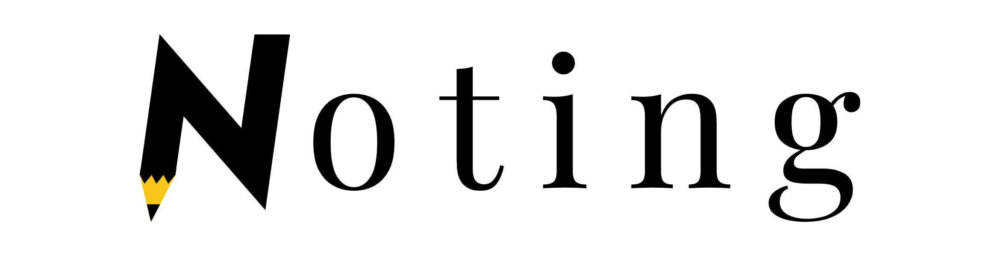

# Noting

Noting is an app focused on fast note taking. It allows you to organize your notes in so called "Sessions" and, 
inside there, creating "notes", "questions" or "tasks" with shortcuts. All the actions are performed with no mouse.

The style is based on Markdown with Katex support for equations.
Additionally, a PDF exporter has been created in order to offer a clean output for the note taking process.

All the project is in current development with new features coming! If you are interested in collaborating just contact me in: davidmorillacabello@gmail.com

## Main features

Currently, the app allows to do the following:

- Create, name, open and save Sessions. They are ultimately a JSON that can be modified/deleted by hand.

- Create, edit, save and move different type of notes (i.e. notes, questions and tasks).

- A PDF exporter using 'python-markdown', [WeasyPrint](https://weasyprint.org/) and an intermediate editable CSS with some exposed HTML classes for personal prefereces.

Obvious things that the app doesn't allow for now:

- Rename, change the date or the author of the Session.

- Rename or delete notes.

See [Roadmap](roadmap) for more information.

## Requirements

Until a final installable version is created, the app requires all the python packages listed below:

* [Python3](https://www.python.org/)

* [PyQt5](https://www.riverbankcomputing.com/software/pyqt/)

* [WeasyPrint](https://weasyprint.org/)

* [Markdown](https://python-markdown.github.io/)

* [markdown-katex](https://gitlab.com/mbarkhau/markdown-katex)

In addition, the installation of WeasyPrint can be tricky (specially for Windows). In order to render Latex formulas in PDF, 
the [markdown-katex](https://gitlab.com/mbarkhau/markdown-katex) package is used. This is known to be supported by WeasyPrint and
the Katex CSS file and the fonts are included locally in the repo. **IMPORTANT FOR WINDOWS USERS** However, the only way I managed it
to render correctly is to install the '.tff' fonts system-wide in the Windows system.

## Usage

Once everything is installed, you can launch 'noting.py' to execute the app. You can create a new session or open a previously created one 
(only compatible files will be recognised and error handling is not yet implemented). Then you can use the following shortcuts:

| Shortcut| Function |
|---------|--------------------|
|Ctrl + N | Creates a new note |
|Ctrl + Q | Creates a new question |
|Ctrl + T | Creates a new task |
|Ctrl + S | Saves the current note |
|Ctrl + O | Saves the current session in a file |
|Ctrl + E | Changes the focus to the list were you can move with the arrows and open notes with Enter |

**IMPORTANT:** I can't stress it enough, currently there is not such thing as auto-save. If you don't save the note and/or 
session and open a new one or closes the app, the changes will be lost!!

### Language

The text is assumed to have Markdown style and the equations are added according to [markdown-katex](https://gitlab.com/mbarkhau/markdown-katex) documentation.

**RECOMMENDATION:** The title of the session is a markdown *h1* (#) and the name of the notes it's a *h2* (##) , so for styling purposes and navigation, it is recommended 
to use *h3* (###) and beyond inside the note text.

### Roadmap

TODO
